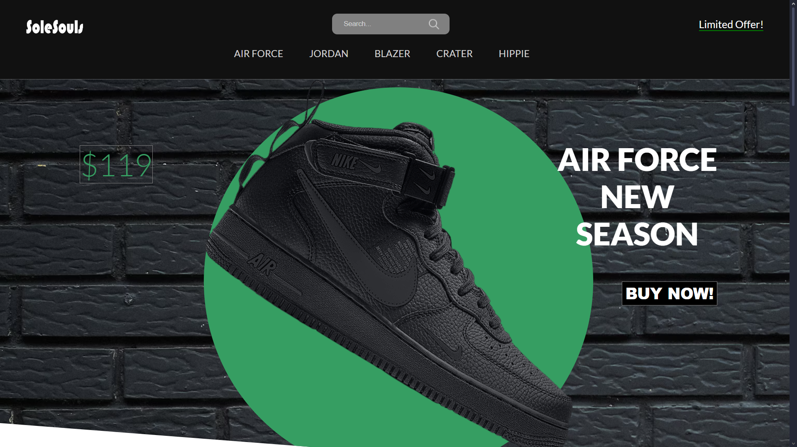

# SoleSouls Web App

This is a simple interactive Shoe Store web application built using HTML, CSS, and JavaScript. It features a product slider, dynamic product selection, and a payment modal.

## Screenshot

## Features

- **Product Slider**: Click on a menu item to slide to the selected shoe.
- **Dynamic Product Details**: Updates the shoe name, price, and image based on selection.
- **Color Selection**: Changes the shoe image based on the selected color.
- **Size Selection**: Highlights the chosen size.
- **Payment Modal**: Opens a payment popup when clicking the "Buy Now" button.

## Technologies Used

- HTML
- CSS
- JavaScript (DOM manipulation)

## How to Use

1. Open `index.html` in a web browser.
2. Click on different shoes from the menu to explore various models.
3. Choose a color to change the shoe appearance.
4. Select a size to highlight the preferred fit.
5. Click the "Buy Now" button to open the payment modal.
6. Close the payment modal using the close button.

## Setup

1. Clone this repository or download the ZIP file.
2. Open `index.html` in a browser.
3. Ensure the `img` folder contains all referenced images.

## Future Enhancements

- Add a backend for order processing.
- Implement a shopping cart system.
- Integrate a real payment gateway.

## License

This project is open-source and free to use.

